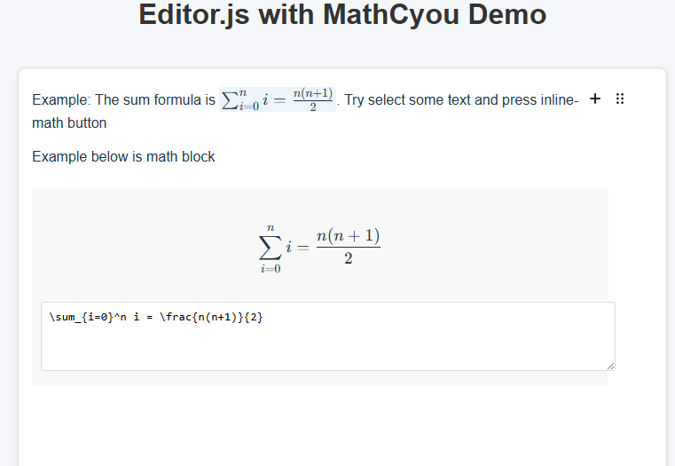

# EditorJS MathCyou

A plugin for Editor.js that adds support for LaTeX math formulas, both inline and as blocks.

Demo: https://chatchit-dc6fa.web.app/



## Features

- **Inline Math Tool**: Add LaTeX equations within your text
- **Math Block Tool**: Add standalone LaTeX equations as blocks
- **KaTeX Integration**: Uses KaTeX for fast and beautiful math rendering
- **Custom Parser**: Helper function to parse the editor's output into a structured format
- **Lightweight**: Minimal dependencies, just EditorJS and KaTeX

## Installation

```bash
npm install editorjs-mathcyou
```

Or using yarn:

```bash
yarn add editorjs-mathcyou
```

## Requirements

- Editor.js v2.20 or higher
- KaTeX v0.13.0 or higher

For Static Build and using WebPack/Vite/... you may need to do

```javascript
import katex from 'katex'
window.katex = katex
```

## Usage

### Basic Setup

```javascript
import EditorJS from '@editorjs/editorjs';
import { InlineMathTool, MathBlockTool, parseEditorOutput } from 'editorjs-mathcyou';
import katex from 'katex';
import 'katex/dist/katex.min.css';

const editor = new EditorJS({
  holder: 'editorjs',
  tools: {
    paragraph: {
      class: Paragraph,
      inlineToolbar: true
    },
    inlineMath: {
      class: InlineMathTool
    },
    mathBlock: {
      class: MathBlockTool
    }
  },
  // ...
});

// To save and parse the content
const saveButton = document.getElementById('save-button');
saveButton.addEventListener('click', async () => {
  const savedData = await editor.save();
  const parsedData = parseEditorOutput(savedData.blocks);
  console.log('Parsed data:', parsedData);
});
```

### Adding Styles

Add the following CSS to your project:

```css
.math-block-wrapper {
  margin: 15px 0;
  padding: 10px;
  background-color: #f8f8f8;
  border-radius: 5px;
}

.math-block-preview {
  display: flex;
  justify-content: center;
  padding: 15px 0;
  overflow-x: auto;
}

.math-block-input {
  width: 100%;
  padding: 8px;
  font-family: monospace;
  border: 1px solid #ddd;
  border-radius: 3px;
  min-height: 60px;
}

.inline-math {
  display: inline-block;
  cursor: pointer;
  padding: 0 2px;
  background-color: rgba(74, 144, 226, 0.1);
  border-radius: 3px;
}
```

Or use the included utility function:

```javascript
import { getStyles } from 'editorjs-mathcyou';

// Add styles programmatically
const styleElement = document.createElement('style');
styleElement.textContent = getStyles();
document.head.appendChild(styleElement);
```

## Contributing

Contributions are welcome! Please feel free to submit a Pull Request.

## License

This project is licensed under the MIT License - see the LICENSE file for details.